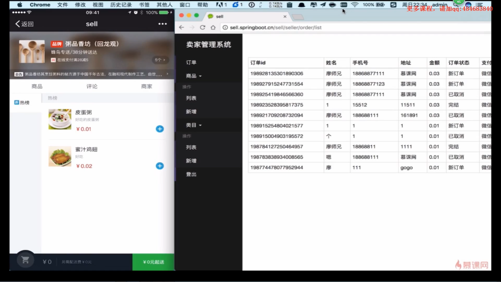
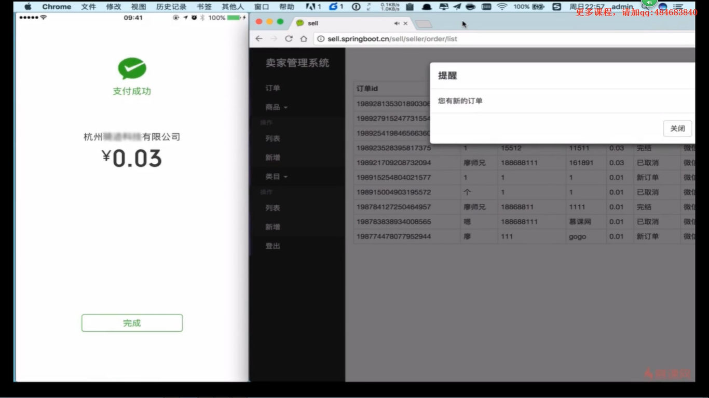
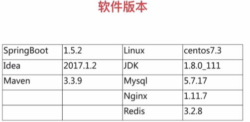
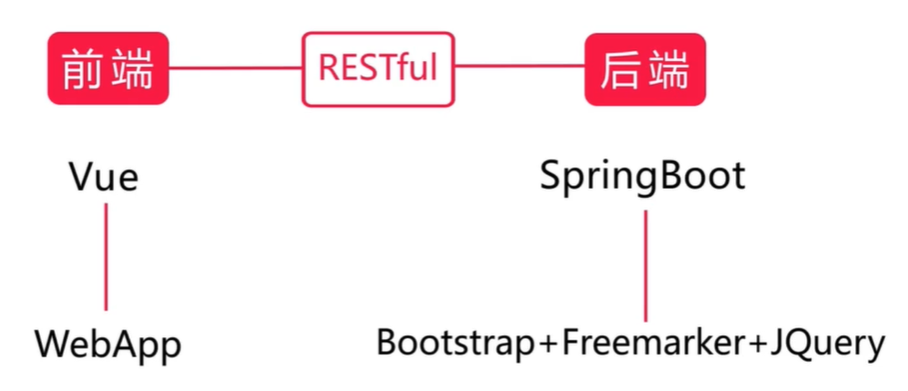
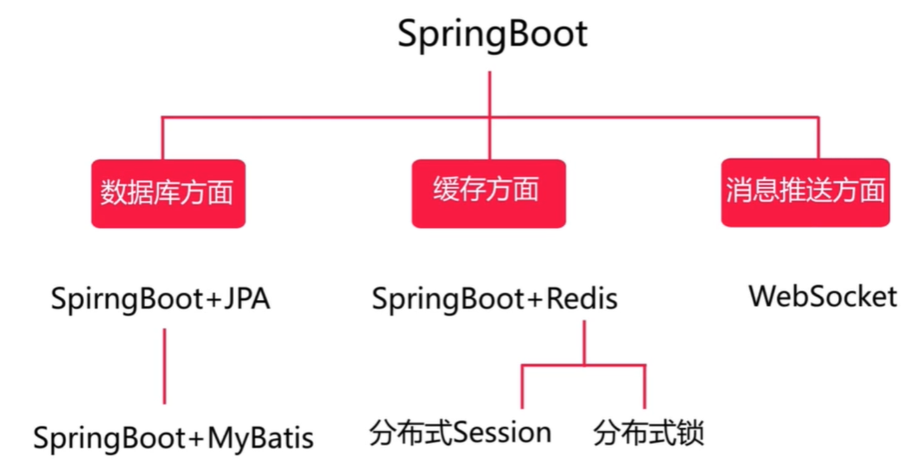
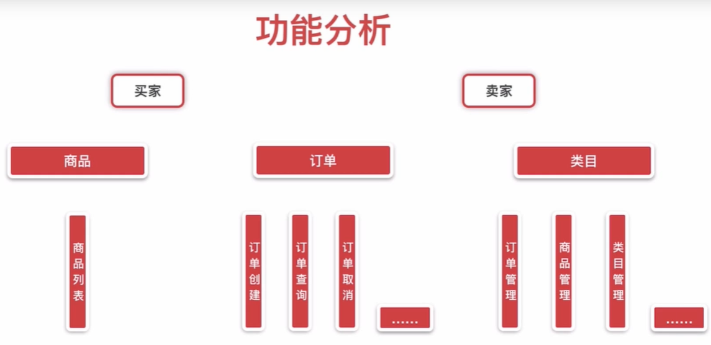
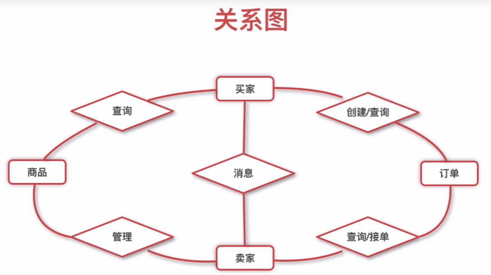
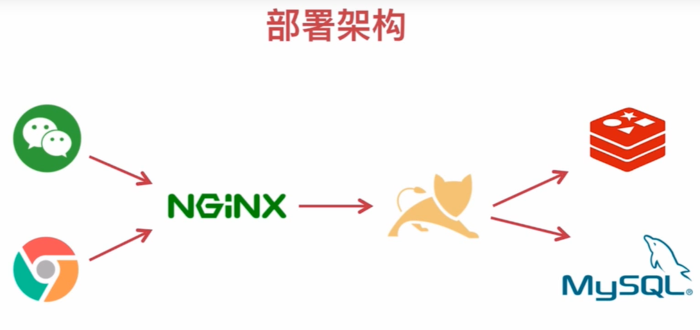
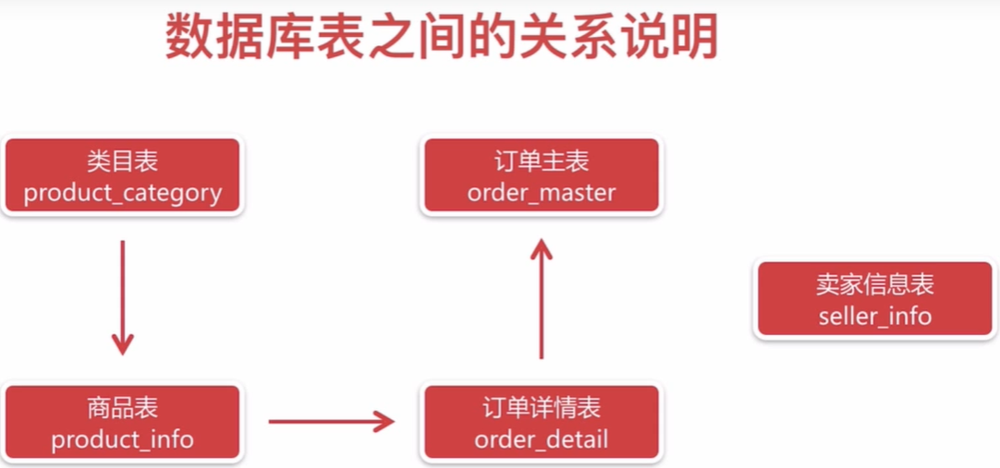

[TOC]

# Springboot微信点餐系统

- 功能展示

- 软件版本

## 项目设计

### 技术要点

- 前后端分离
  
- 相关技术
  
  
  

### 角色划分

- 买家：微信端
- 卖家：PC端

### 功能模块分析

- 功能分析

- 关系图

### 部署架构

### 数据库设计

- 数据库表关系

- 数据库表设计

  [SQL.md](SQL.md)

~~~sql
-- --------------------------------
-- Table structure for product_info
-- --------------------------------
-- 商品
create table `product_info`(
	`product_id` varchar(32) not null,
	`product_name` varchar(64) not null comment '商品名称',
	`product_price` decimal(8,2) not null comment '单价',
	`product_descripition` varchar(64) comment '描述',
	`product_icon` varchar(512) comment '小图',
	`category_type` int not null comment '类目编号',
	`create_time` timestamp not null default current_timestamp comment '创建时间',
	`update_time` timestamp not null default current_timestamp on update current_timestamp comment '修改时间',
	primary key (`product_id`)
) comment '商品表';

-- --------------------------------
-- Table structure for product_category
-- --------------------------------
-- 类目
create table `product_category`(
	`category_id` int not null auto_increment,
 	`category_name` varchar(64) not null comment '类目名字',
  	`category_type` int not null comment '类目编号',
  	`create_time` timestamp not null default current_timestamp comment '创建时间',
	`update_time` timestamp not null default current_timestamp on update current_timestamp comment '修改时间',
	primary key (`category_id`),
  	unique key `uqe_category_type` (`category_type`)
) comment '类目表';

-- --------------------------------
-- Table structure for order_master
-- --------------------------------
-- 订单
create table `order_master`(
	`order_id` varchar(32) not null,
  	`buyer_name` varchar(32) not null comment '买家姓名',
  	`buyer_phone` varchar(32) not null comment '买家电话',
  	`buyer_address` varchar(128) not null comment '买家地址',
    `buyer_openid` varchar(64) not null comment '买家微信openid',
  	`order_amount` decimal(8,2) not null comment '订单总金额',
  	`order_status` tinyint(3) not null default '0' comment '订单状态,默认新下单',
  	`pay_status` tinyint(3) not null default '0' comment '支付状态,默认0未支付',
 	 `create_time` timestamp not null default current_timestamp comment '创建时间',
	`update_time` timestamp not null default current_timestamp on update current_timestamp comment '修改时间',
  	primary key (`order_id`),
  	key `idx_ buyer_openid` (`buyer_openid`)
) comment '订单表';

-- --------------------------------
-- Table structure for order_detail
-- --------------------------------
-- 订单详情
create table `order_detail`(
	`detail_id` varchar(32) not null,
  	`order_id` varchar(32) not null,
  	`product_id` varchar(32) not null,
  	`product_name` varchar(64) not null comment '商品名称',
  	`product_price` decimal(8,2) not null comment '商品价格',
  	`product_quantity` int not null comment '商品数量',
  	`product_icon` varchar(512) not null comment '商品小图',
  	`create_time` timestamp not null default current_timestamp comment '创建时间',
	`update_time` timestamp not null default current_timestamp on update current_timestamp comment '修改时间',
  	primary key (`detail_id`),
  	key `idx_order_id` (`order_id`)
) comment '订单详情';

-- --------------------------------
-- Table structure for seller_info
-- --------------------------------
-- 卖家(登录后台使用, 卖家登录之后可能直接采用微信扫码登录，不使用账号密码)
create table `seller_info` (
    `id` varchar(32) not null,
    `username` varchar(32) not null,
    `password` varchar(32) not null,
    `openid` varchar(64) not null comment '微信openid',
    `create_time` timestamp not null default current_timestamp comment '创建时间',
    `update_time` timestamp not null default current_timestamp on update current_timestamp comment '修改时间',
    primary key (`id`)
) comment '卖家信息表';

~~~

## 开发环境搭建

[环境文档](ENV.md)

## 功能实现
